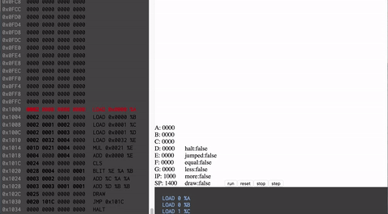

# Tiny Assembly

**Live Demo:** [https://tinyassembly.herokuapp.com/](https://tinyassembly.herokuapp.com/).

## Introduction

This project is meant to be an emulator for a very simple computer architecture that runs in the browser. It has a compact instruction set, a graphics interface to push pixels around on a virtual screen, an assembler and disassembler, and a very basic debugger.

## Interesing bits of code
If you want to understand how this works, here's a list of files to look into that might be of interest:

* [Definitions of all the instructions](https://github.com/ichub/tinyassembly/blob/master/src/InstructionSet.ts)
* [The CPU](https://github.com/ichub/tinyassembly/blob/master/src/CPU.ts)
* [The Assembler](https://github.com/ichub/tinyassembly/blob/master/src/Assembler.ts)
* [Example code of the Fibonacci sequence in assembly](https://github.com/ichub/tinyassembly/blob/master/src/tests/programs/FibonacciProgram.ts)

## Deployment

This repository is automatically pulled, compiled, tested, and deployed by [https://travis-ci.org/](https://travis-ci.org/). All of the tests are located in the [tests](https://github.com/ichub/tinyassembly/tree/master/src/tests) directory.
